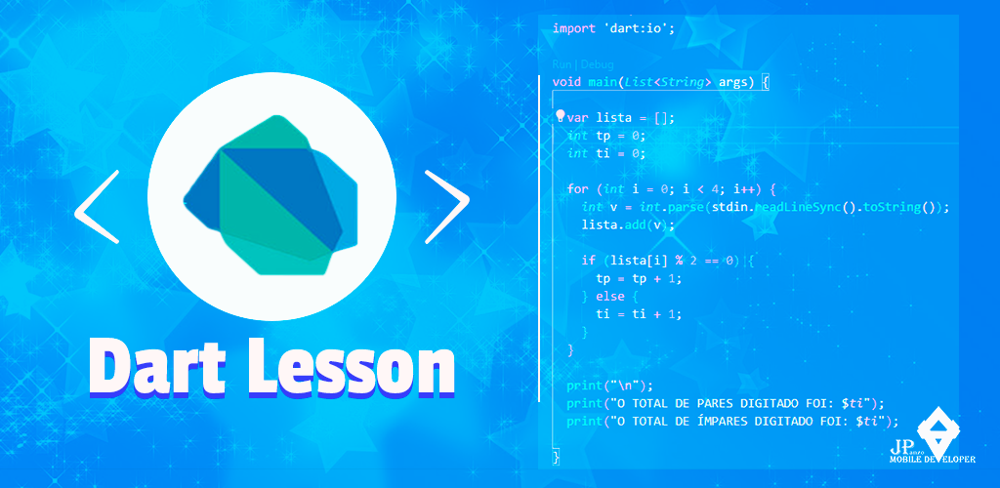

<h1 align="center">
    
Dart Lesson

</h1>

## About

Este é um repositorio dedicado aos meus estudos em dart. Aqui const lições desde o básico ao avançado em dart. Visto que ostudos nunca param este repositorio será sempre atualizado.
***
***

***
***
***
***
## 🔨 Tools

- Dart: 2.16.2
- Visual Studio Code

***
***
***
***

## ❄ How Contribute
***
***Clone project***
***
$ git clone https://github.com/josuepanzo/DartLesson/
   

***
***
***
***
## 🙍‍♂️ Authors

  **Josué António Dias Panzo**
  ***
  - My - <a href="https://www.linkedin.com/in/josuepanzo5/" target="_blank">Linkedin</a>

Please follow github

Thanks to visiting me and good coding!
***
***
***
***
## 🧧 Licenses
***
This project is under the **MIT License**. See the file **LICENSE** for more details.